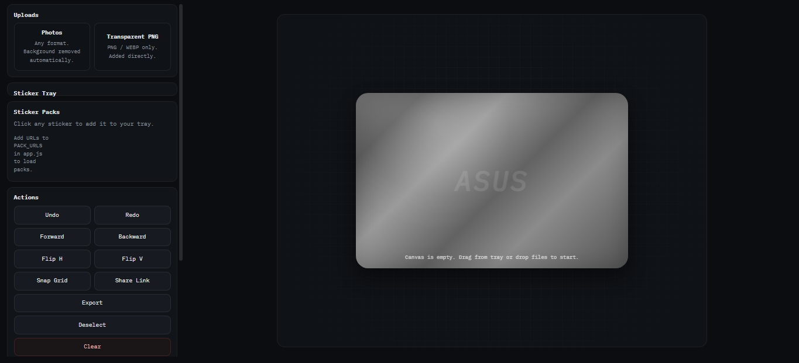

# Sticker Planner

## Preview




Sticker Planner is a full-stack vanilla web app for planning sticker layouts on a laptop/device image. It keeps the existing cyber dark UI and sticker workflow while using a Node.js + Express backend with temporary in-memory storage.

## Technologies

- HTML
- CSS
- Vanilla JavaScript
- Node.js
- Express
- dotenv

## Final Project Structure

```text
sticker-planner
├── public
│   ├── index.html
│   ├── css
│   │   └── style.css
│   ├── js
│   │   └── app.js
│   └── files
├── server.js
├── package.json
├── package-lock.json
├── .env
├── .gitignore
└── README.md
```

## Install

```bash
npm install
```

## Run

```bash
npm run dev
```

Open: `http://localhost:3000`

Production start:

```bash
npm start
```

## API Routes

Base: `/api`

- `GET /api/health`
- `GET /api/state`
- `GET /api/stickers`
- `POST /api/stickers`
- `PUT /api/stickers/:id`
- `DELETE /api/stickers/:id`
- `DELETE /api/stickers`
- `GET /api/layouts`
- `POST /api/layouts`
- `GET /api/layouts/:id`
- `PUT /api/layouts/:id`
- `DELETE /api/layouts/:id`
- `POST /api/reset`

Errors are JSON:

```json
{ "error": "Message here." }
```

## In-Memory Backend Notes

- App data is stored in server memory only.
- Data is available while the Node process is running.
- Restarting the server resets stickers/layouts/settings.
- Storage logic is intentionally isolated in `server.js` so MySQL can be added later by replacing the storage layer.

## Frontend Features

- Upload photos (remove.bg flow)
- Upload pre-cut PNG/WEBP stickers
- Drag stickers from tray to laptop canvas
- OS drag/drop image placement on canvas
- Move, resize, rotate stickers
- Flip horizontal / vertical
- Layer forward / backward
- Sticker tint (hue/saturation/brightness)
- Snap to grid toggle
- Multi-select (Shift+click and drag box)
- Share link hash encoding
- Export PNG
- Clear all stickers (with confirmation)
- Swap device image
- Backend status indicator bar
- Empty tray and empty canvas guidance

## Manual Test Checklist

- [ ] `npm install` works
- [ ] `npm run dev` starts server
- [ ] App opens at `http://localhost:3000`
- [ ] `GET http://localhost:3000/api/health` works
- [ ] `GET http://localhost:3000/api/state` works
- [ ] Upload sticker works
- [ ] Place sticker works
- [ ] Move sticker works
- [ ] Resize sticker works
- [ ] Rotate sticker works
- [ ] Flip sticker works
- [ ] Tint sticker works
- [ ] Delete sticker works
- [ ] Clear all stickers asks for confirmation
- [ ] Backend status indicator works
- [ ] Browser refresh reloads backend stickers while server is running
- [ ] Server restart resets in-memory data
- [ ] No FastAPI or MongoDB dependency remains
- [ ] README is accurate
